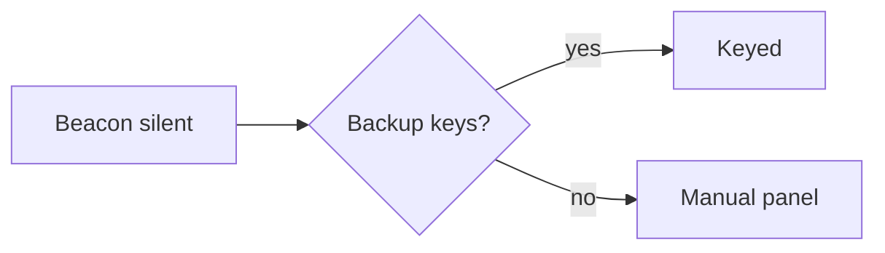

# Diagrams

Write a Mermaid diagram in a fenced block, and you see the diagram drawn where it sits in the document. A README that shows a diagram on GitHub shows the same diagram here.

## Draw a diagram

Write a fenced block with the language `mermaid`:

````markdown

````

The diagram is drawn once the closing fence is there. Flowcharts, sequence, state and class diagrams, gantt charts, pie charts, timelines, quadrant charts, XY charts and sankey diagrams all draw, along with the other kinds Mermaid knows.

## Edit a diagram

1. Put the caret on the diagram.
2. Press Cmd+Alt+E (Ctrl+Alt+E on Windows and Linux), or choose **Edit Markdown**. The fence and its source appear.
3. Move on, and the diagram is drawn again.

## Fix a diagram that will not draw

Read Mermaid's message under the source. A diagram that does not parse shows its source, with that message about what is wrong. Every diagram looks like that for a moment while you are writing one, so nothing is lost and nothing is replaced with a blank box.

## Scroll a wide diagram

A diagram is drawn at its own size when the column has room for it. In a narrower pane it shrinks to fit, down to a width where its text is still readable. Below that it scrolls sideways inside its own box. The box is a stop on the Tab key: press Tab to reach it, and scroll it from the keyboard.

## Good to know

- A diagram follows your theme. It is drawn in dark colours in a dark theme, and drawn again when you switch.
- Mermaid ships inside the extension, so diagrams draw with no network and nothing to configure. It loads the first time a document with a diagram opens, so a document without one opens no slower for it.
- A fence that has not been closed yet stays as text, so the rest of the document is never swallowed into a diagram while you type the opening fence.
- A `mermaid` fence inside a quote or a list is left as text.
- Drawing a diagram is decoration. The file keeps the fence exactly as you wrote it.
