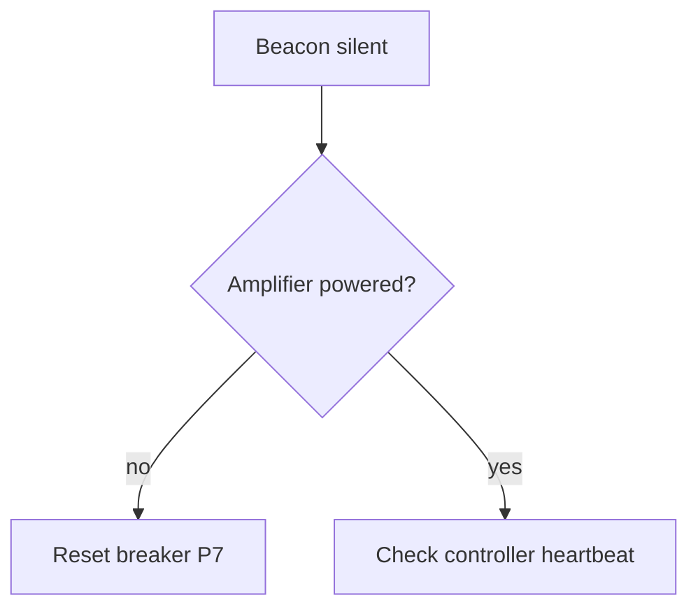

# Tier 3: what Sheaf adds

Everything in [commonmark.md](commonmark.md) and [github.md](github.md), plus the layer Sheaf puts on top. Nothing in this file is CommonMark or GFM, so every construct here is one another editor will draw differently or not at all.

Sheaf's dialect is CommonMark, the five GFM extensions, emoji shortcodes, and the two marks below. That is the whole of it; there is no configuration and no plugin list.

## Highlight

==Text between double equals== is highlighted. It is the mark for the one line in a document that matters, and it has no equivalent in CommonMark or GFM.

The equals signs must touch the text they wrap, so == this is not a highlight == stays as typed.

## Strikethrough, one tilde or two

~~Two tildes~~ is the GFM spelling and works as it does everywhere.

~One tilde~ also strikes through, which GFM does not do. This is a deliberate difference: on github.com a single tilde is literal text, and Sheaf reads it as a strike because that is what people expect from having used other editors.

That choice has a consequence worth knowing. Pandoc reads `~text~` as a subscript and `^text^` as a superscript, and Sheaf does neither. In Sheaf `H~2~O` is struck through rather than subscripted, and `2^10^` is a literal pair of carets. Where a document needs a subscript or a superscript, write it as HTML, which is what github.com reads as well: H<sub>2</sub>O and 2<sup>10</sup>.

## Emoji shortcodes

A name between colons is recognised as a shortcode: :satellite: :coffee: :heavy_check_mark: :warning: :cat:

Sheaf reads them but draws them as typed for now, where github.com substitutes the character. The characters themselves are always safe to write, and are what a resolved shortcode becomes: 🛰 ☕ ✔️ ⚠️ 🐈

## Data blocks

A fenced block marked `csv` is drawn as a grid rather than as code, and edited as one. The file keeps the comma-separated text.

```csv
orbit,date,enter,exit,minutes,charge_at_exit_pct
6100,2244-11-01,03:23,04:00,37,82
6101,2244-11-01,15:12,15:49,37,82
6102,2244-11-02,03:00,03:37,37,83
```

Tab-separated works the same way:

```tsv
band	peak	month
Hydrogen line	61	July
Water maser	180	June
```

Quoting follows the usual rules, so a field holding a comma is wrapped:

```csv
time,band,note
02:19,Unexplained narrowband,"beacon dark, nothing transmitting"
```

## Diagrams and charts

Written as fenced blocks that other tools draw. Sheaf keeps them as source today and the text stays readable either way, which is the reason for choosing formats that read as text.



```vega-lite
{
  "$schema": "https://vega.github.io/schema/vega-lite/v5.json",
  "data": {"values": [{"m": "Jan", "n": 6}, {"m": "Feb", "n": 15}, {"m": "Mar", "n": 12}]},
  "mark": "bar",
  "encoding": {
    "x": {"field": "m", "type": "ordinal", "sort": null},
    "y": {"field": "n", "type": "quantitative"}
  }
}
```

## Maths

Inline between single dollars, so $E = mc^2$ sits in the sentence, and display between double dollars. Sheaf typesets both, and the file keeps the LaTeX:

$$
P_r = P_t \, G_t \, G_r \left( \frac{\lambda}{4 \pi d} \right)^2
$$

## Images with size, position and a caption

Plain Markdown covers the address and the alt text and nothing else, so anything more is written as HTML on one line. This is the same contract GitHub offers, and a document using it renders in both.

A width, in pixels:


Pushed to an edge:


Centred, which needs a wrapper because the attribute only works on a block element:

<p align="center"></p>

With a caption, which needs a figure:

<figure><figcaption>The caption sits under the picture and is part of the figure.</figcaption></figure>

Captioned and aligned together, which is a figure inside a div, because a paragraph cannot hold a figure:

<div align="center"><figure><figcaption>Centred, with a caption.</figcaption></figure></div>

An image with none of those attributes round-trips as ordinary Markdown; the moment one is added it becomes the HTML form above and stays that way.

## Front matter

A YAML block at the very top of a file is metadata for other tools, and is drawn as quiet monospaced text rather than as a heading and a list. See the top of any document in [sample/wren-4/](../wren-4/) for one in use.
