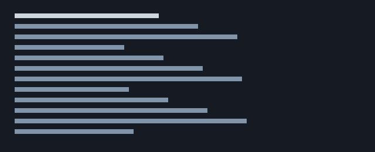

# Getting Started with the Ferry CLI

A step-by-step tutorial: numbered steps that carry code blocks, callouts, checklists, and images inside them. This is the construct mix that trips up list handling most often.

**Time:** about 20 minutes
**You will need:** Node 20 or newer, a terminal, and an API token

---

## 1. Install

Install globally, or run it once with `npx` if you would rather not:

```sh
npm install -g @ferry/cli
# or, without installing:
npx @ferry/cli --version
```

Confirm it works:

```console
$ ferry --version
ferry 2.4.0 (node 20.11.1, darwin-arm64)
```

> 💡 **Tip:** If `ferry` is not found after a global install, your npm prefix's `bin` directory is not on `PATH`. `npm config get prefix` tells you where it went.

## 2. Authenticate

1. Open the dashboard and create a token with the `sailings:read` scope.

2. Store it where the CLI can find it:

   ```sh
   ferry auth login --token-stdin < token.txt
   ```

   The token is written to `~/.config/ferry/credentials.toml` with mode `0600`. Nothing is sent anywhere until you run a command that needs it.

3. Verify:

   ```sh
   ferry auth whoami
   ```

   ```console
   account  acct_7Nq         (Northwind Crossings)
   scopes   sailings:read
   expires  2045-03-01
   ```

> ⚠️ **Warning:** `--token` on the command line lands in your shell history. Prefer `--token-stdin`.

## 3. Your first query

List tomorrow's sailings on route `NW-14`:

```sh
ferry sailings list --route NW-14 --from tomorrow --limit 5
```

```console
ID           DEPARTS            VESSEL  STATUS     SOLD
sail_4Kd92L  2044-06-11 07:20   ves_81  scheduled  411/480
sail_9Pm31X  2044-06-11 09:40   ves_81  scheduled  120/480
sail_2Wc77B  2044-06-11 12:10   ves_44  scheduled   38/300
sail_5Hn08K  2044-06-11 15:35   ves_44  boarding   287/300
sail_8Tz62R  2044-06-11 18:00   ves_81  scheduled    0/480
```

Add `--json` to get the raw payload, which is what you want when piping into `jq`:

```sh
ferry sailings list --route NW-14 --json | jq '[.data[] | {id, sold: .capacity.sold}]'
```

## 4. Watch a route

`watch` polls and re-renders in place. It is the fastest way to see the delay events land:

```sh
ferry sailings watch --route NW-14 --interval 30s
```



Press <kbd>q</kbd> to quit, <kbd>r</kbd> to force a refresh.

## 5. Script it

Anything the CLI prints as `--json` is stable enough to script against. A small check that alerts when a sailing sells past 90%:

```sh
#!/usr/bin/env bash
set -euo pipefail

threshold=0.9

ferry sailings list --route "$1" --json \
  | jq -r --argjson t "$threshold" '
      .data[]
      | select(.capacity.sold / .capacity.passengers > $t)
      | "\(.id) \(.departs_at) \(.capacity.sold)/\(.capacity.passengers)"
    '
```

Run it on a schedule:

```cron
*/15 * * * * /usr/local/bin/check-capacity NW-14 >> /var/log/ferry-capacity.log 2>&1
```

## 6. Clean up

- [x] Installed the CLI
- [x] Stored a token
- [x] Listed sailings
- [ ] Revoked the token when you are done experimenting
- [ ] Removed `token.txt` from disk

```sh
ferry auth logout
rm -f token.txt
```

---

## Where to go next

| If you want to… | Read |
| :--- | :--- |
| Call the API directly | [API reference](api-reference.md) |
| Understand the scheduling model | [Design note](rfc-0148-scheduling.md) |
| See what changed recently | [Changelog](changelog.md) |

## Troubleshooting

<details>
<summary><strong>`ferry: command not found` after installing</strong></summary>

Your npm global `bin` is not on `PATH`. Add it:

```sh
export PATH="$(npm config get prefix)/bin:$PATH"
```

</details>

<details>
<summary><strong>Every request returns 401</strong></summary>

The token is expired or was created in a different environment. `ferry auth whoami` shows which account and expiry the stored token belongs to.

</details>

<details>
<summary><strong>`watch` flickers over SSH</strong></summary>

The terminal is not reporting its size. Pass `--width 120` explicitly, or set `COLUMNS`.

</details>
