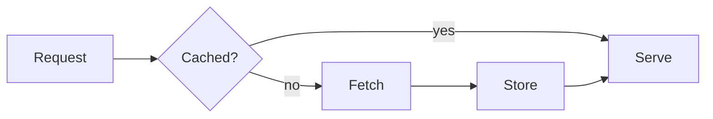
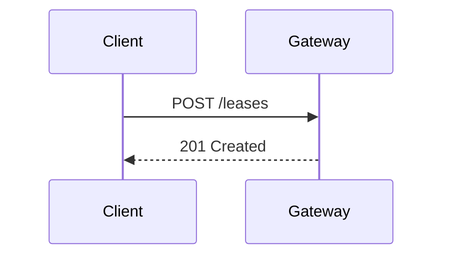
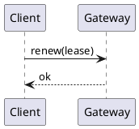
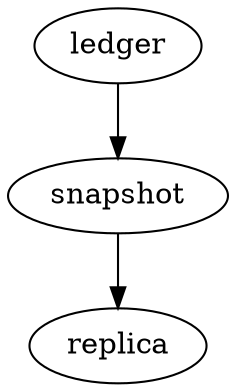

# Dialects

Syntax that other tools add on top of CommonMark and GFM. People paste these into repo docs because their wiki, their notes app or their static site generator understands them. Sheaf does not have to render all of them, but it must display each one legibly and leave its bytes alone.

## GitHub alerts

> [!NOTE]
> The nightly export runs at 02:00 in the cluster's local time.

> [!TIP]
> Pass `--dry-run` first. It prints the plan without touching the ledger.

> [!IMPORTANT]
> Rotate the signing key before the lease expires.

> [!WARNING]
> Replicas older than 0.9 cannot read the new snapshot format.

> [!CAUTION]
> `purge --all` deletes every checkpoint, including the pinned ones.

> [!note]
> Lower-case markers are accepted by GitHub too.

> [!NOTE]
Lazy continuation: this line belongs to the alert even without its `>`.

> [!UNKNOWN]
> An unrecognised type. GitHub renders it as a plain quote.

## Note-app callouts

> [!tip] A custom title
> Callouts in note apps take an optional title after the marker.

> [!faq]- Folded by default
> The trailing minus means the callout starts collapsed.

> [!example]+ Expanded by default
> And a plus means it starts open.
>
> > [!warning] Nested
> > Callouts can nest inside callouts.

## Wiki links and embeds

See [[Scheduler design]] for the background, or [[Scheduler design#Leases|the section on leases]].

Embedded note: ![[Weekly review template]]

Embedded image with a width: ![[rye-loaf.png|240]]

Block reference: [[Runbook#^step-4]] and a block ID at the end of a line. ^step-4

## Highlights, subscripts and superscripts

This sentence has ==highlighted text== in it.

Water is H~2~O and the area is 12 m^2^. GFM reads `~2~` as strikethrough, so this line renders differently depending on the dialect.

## Definition lists

Lease
:   A time-limited claim on a shard. Expires unless renewed.

Quota
:   The ceiling on concurrent leases per namespace.
:   A second definition for the same term.

Term with *emphasis*
: A single-space definition marker, as some parsers allow.

## Heading attributes

### Heading with an explicit ID {#custom-id}

### Heading with classes {.unnumbered .unlisted}

Link to it: [jump](#custom-id).

## Abbreviations

The API returns JSON over HTTP.

*[API]: Application Programming Interface
*[HTTP]: Hypertext Transfer Protocol

## Emoji shortcodes

Build passed :white_check_mark: and the deploy is :rocket: queued. A colon-word that is not an emoji: 10:30:45 and `:not_code:` in code.

## Tables of contents markers

[TOC]

[[_TOC_]]

${toc}

## Maths

Inline with dollars: $e^{i\pi} + 1 = 0$. A price that is not maths: it costs $5 or $10.

Inline with backtick-dollar, as GitHub also accepts: $`\sqrt{2}`$.

$$
\sum_{k=1}^{n} k = \frac{n(n+1)}{2}
$$

```math
\begin{aligned}
  \nabla \cdot \mathbf{E} &= \frac{\rho}{\varepsilon_0} \\
  \nabla \cdot \mathbf{B} &= 0
\end{aligned}
```

## Diagrams









## Setext headings

A level-one setext heading
==========================

A level-two setext heading
--------------------------

Underline shorter than the text
===

This line is a paragraph. The dashes directly below it turn it into a level-two heading.
---

## Line blocks

| The first line of a verse,
|    indented continuation,
| and a last line.

## Keyboard and small caps

Press <kbd>Ctrl</kbd>+<kbd>Shift</kbd>+<kbd>P</kbd>. In some dialects [Small Caps]{.smallcaps} is a span with a class.

## Comments

<!-- An HTML comment that should stay invisible. -->

%% A note-app comment, also meant to be invisible. %%

[//]: # (The link-definition trick for a comment that every CommonMark parser hides.)
