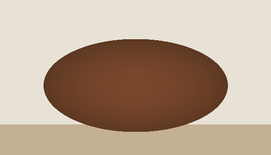
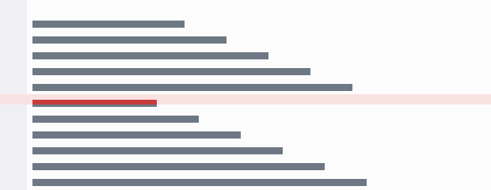
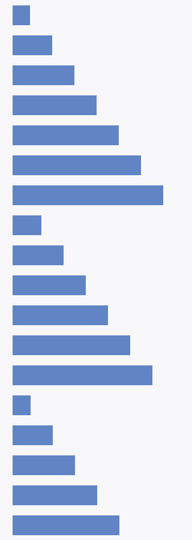

# Images

Every way an image can appear, including the ones Sheaf upgrades to inline HTML.

Markdown itself has no syntax for size, alignment, or captions. Sheaf writes the HTML for exactly the image you acted on and leaves every other byte alone — so a resized image looks like the block below, and the rest of the file is untouched.

## Plain Markdown images

Inline in a sentence: here is a dot  mid-paragraph.

Block image on its own line:


With a title attribute:



Empty alt text (decorative):


Reference-style:

![Terminal at dawn][dawn]

[dawn]: ../assets/terminal-dawn.png "Reference-style image"

Linked image — clicking should follow the link, not open the editor:

[](https://example.com)

## Sized and aligned (HTML upgrade)


<p align="center">
  
</p>

 — sized inline, next to text.

<figure>
  
  <figcaption>A caption, which Markdown has no way to express.</figcaption>
</figure>

## Overflow

Wider than any editor pane — should scale down or scroll, never push the layout sideways:


Taller than the pane:



## Broken and unusual sources

Missing file:


Missing file, with a title:


Absolute remote URL (will not load offline):


Data URI — a 1×1 transparent GIF:


SVG by path:


Path with spaces and parentheses:


## Images in other containers

In a list:

- First item
- Item with an image: 
- Item with a block image below it:

  

- Last item

In a table:

| Preview | Name | Size |
| :---: | :--- | ---: |
|  | dot.png | 16×16 |
|  | dot.png again | 16×16 |
|  | missing.png | — |

In a blockquote:

> 
>
> An image inside a quote.

In a heading:

### A heading with  in it

Inside a code fence — this must render as text, not as an image:

```markdown


```
