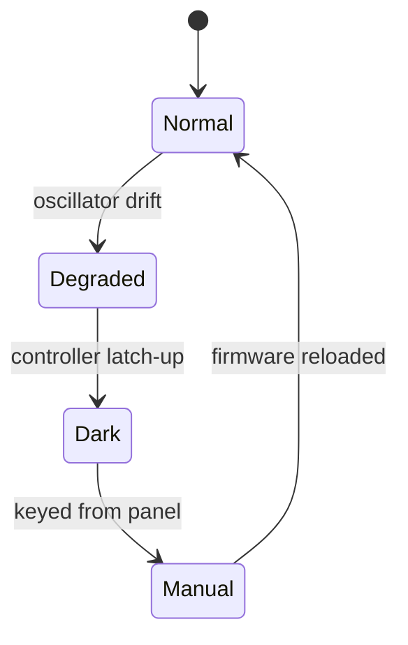

# Wren-4 Beacon Station

Wren-4 is a two-crew navigation beacon at the trailing Lagrange point of the gas giant Vesna c. Ships crossing the Oriel Belt steer by its pulse. Everything the station knows is written down here, in the files the next crew will open.


## The month, in a table

| | November 2244 |
| :--- | ---: |
| Beacon uptime | 99.938% |
| Minutes dark, unplanned | 27 |
| Radio blackout hours | 13 |
| Ships logged | 271 |
| Peak solar wind | 981 km/s, 2244-11-17 |
| Crew dose | 853 µSv |
| Cats aboard | 1 |
| Cats on the manifest | 0 |

Solar wind, day by day: ▂▂▂▁▁▁▁▂▂▂▂▁▁▂▄▆█▆▄▂▂▁▁▂▁▂▁▁▁▁

## The crew, in a grid

Records that something else might sort or plot are kept as a `csv` block, which reads as a grid and stays comma-separated on disk.

```csv id=crew
name,role,aboard since,watch
Ada Quill,Station chief,2231,A
Tomas Bray,Systems technician,2242,B
MOTH-3,Maintenance drone,2238,either
Fresnel,Cat,2240,every
```

Fresnel is not on the manifest and has never missed a watch.

## The pulse, in maths

The link budget keeps its working, because the answer is wrong the moment the geometry moves. At $f = 8.45$ GHz the free-space term is

$$L_{fs} = 20\log_{10}\left(\frac{4\pi d}{\lambda}\right)$$

## The outage, as a diagram

Nothing about the night of the 17th reads more clearly in prose than it does here.



## The panel, in one command

```sh
beaconctl status --watch
```

## Standing orders

1. Two people for anything outside. No exceptions, and none have ever been asked for.
2. The beacon comes first. Choosing between the beacon and the hydroponics, shed the hydroponics.
3. Log the watch before you sleep, not after you wake. Quill will know.
4. ==If the beacon goes quiet, open the runbook before you open the panel.==

> [!WARNING]
> The hub does not turn. Anyone who has slept through a spin-up says so once, and never again.

## What is in the other files

The log keeps one row per day with the month's charts. The incident report covers twenty-seven minutes of silence during a coronal mass ejection. The specification carries the pulse format and the link budget. Space weather holds the year as a table and as four charts, eclipses as a `csv` block, traffic by class and day, signals as sixteen bands across twelve months with a heat map, maintenance as a Gantt chart, and the runbook for a beacon that will not transmit. There is one recipe aboard, scaled for one crew to six.

> Every 26 days since 2230, something out in the trailing cluster has sent this station a signal. Nobody knows what it is. Quill calls it instrument noise, so I am writing it down instead. Start with the *Unexplained narrowband* row on the [signals page](signals.md#detections).
>
> Bray, for whoever reads this next

Before you hand over to the crew after you:

- [ ] Read the runbook front to back, not the summary
- [ ] Walk the ring once with the outgoing chief
- [ ] Find out what the narrowband is

<!-- The documents table does not list every room. -->
