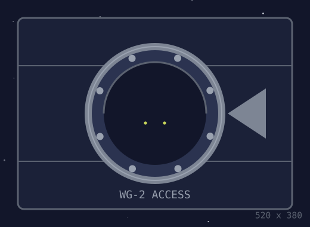
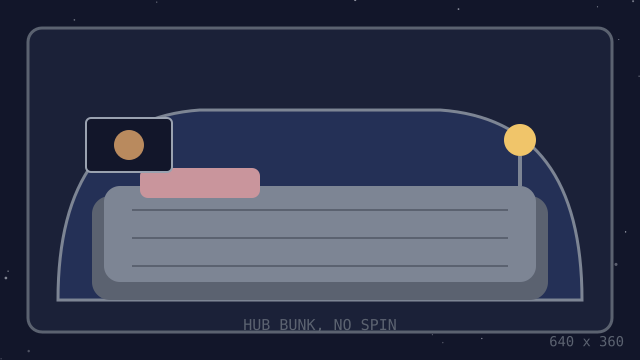
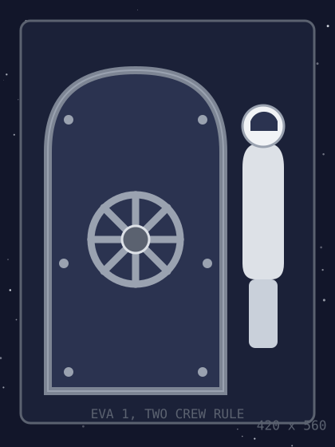

# Fresnel

| | |
| :--- | :--- |
| Species | Cat, probably |
| Colour | Grey, with a white mark on her chest shaped like a Fresnel lens, hence the name |
| Weight | 3.9 kg |
| Arrived | 2240-03-14, 02:14 station time |
| Arrived how | Unknown. No ship docked between 2240-02-20 and 2240-04-02. |
| Found | Asleep in the waveguide access port, warm |
| On the manifest | No |

<figure><figcaption>WG-2. She came out of this at 02:14 with no ship docked.</figcaption></figure>

## Favourite places

| Place | How often | Notes |
| :--- | :--- | :--- |
| The cupola | Daily | Watches the trailing cluster. Only the trailing cluster. |
| Hydroponics | When there are moths | There should never be moths |
| The console | Always | See the [calibration schedule](../maintenance.md#calibration-schedule) |
| The waveguide access port | Every 26 days or so, for about a minute | Bray has timed it. See fault `B5` in the [runbook](../runbooks/beacon-silent.md#fault-codes). |

Vet notes, from the tender's medic, 2240-04-02

- Healthy adult female, about two years old.
- Microchipped. The chip reads `0x5704`, which is this station's ID. Nobody aboard chipped her.
- Lifetime radiation dose: zero. Anything that crossed the belt in the open would carry more than the crew does.
- Refused the medic's treats. Accepted Bray's.

The two she actually uses, in order:

 

The bunk because it does not turn, and the hatch because the suit is warm.

[.svg>)](fresnel.svg)

The mark on her chest is a lens, etched not printed. Nobody at the yard chips a cat with a lens.

## Rules

1. Do not feed her from the console.
2. Do not let her into the transmitter bay.
3. If she sits by the waveguide access port, let her. It is over in about a minute.
