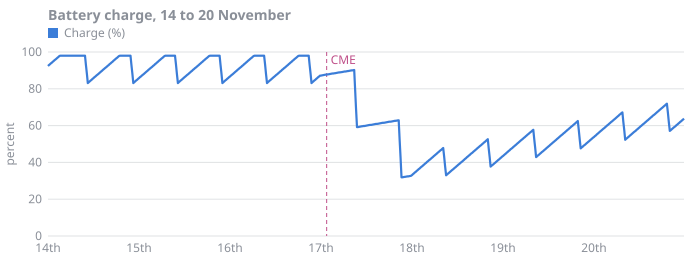

# Eclipses and power

Wren-4 orbits Vesna c once every 11.8 hours. Once per orbit the station passes through the planet's shadow and runs on batteries. November is the start of eclipse season, so the shadow passes get longer every day.

Minimum battery charge at the end of an eclipse is 40%. Below that, the beacon sheds the bulletin channel to protect the timing pulse.



## Every eclipse this month

```csv
orbit,date,enter,exit,minutes,charge_at_exit_pct
6100,2244-11-01,03:23,04:00,37,82
6101,2244-11-01,15:12,15:49,37,82
6102,2244-11-02,03:00,03:37,37,83
6103,2244-11-02,14:48,15:25,37,81
6104,2244-11-03,02:36,03:14,38,83
6105,2244-11-03,14:23,15:01,38,83
6106,2244-11-04,02:12,02:50,38,82
6107,2244-11-04,14:00,14:38,38,82
6108,2244-11-05,01:48,02:27,39,81
6109,2244-11-05,13:36,14:15,39,82
6110,2244-11-06,01:24,02:03,39,81
6111,2244-11-06,13:12,13:51,39,81
6112,2244-11-07,01:00,01:40,40,82
6113,2244-11-07,12:48,13:28,40,82
6114,2244-11-08,00:36,01:16,40,81
6115,2244-11-08,12:24,13:04,40,80
6116,2244-11-09,00:12,00:53,41,81
6117,2244-11-09,12:00,12:41,41,81
6118,2244-11-09,23:48,00:29,41,81
6119,2244-11-10,11:36,12:17,41,80
6120,2244-11-10,23:24,00:05,41,80
6121,2244-11-11,11:12,11:54,42,80
6122,2244-11-11,23:00,23:41,42,79
6123,2244-11-12,10:48,11:30,42,79
6124,2244-11-12,22:36,23:18,42,81
6125,2244-11-13,10:23,11:06,43,80
6126,2244-11-13,22:11,22:54,43,81
6127,2244-11-14,10:00,10:43,43,84
6128,2244-11-14,21:48,22:31,43,83
6129,2244-11-15,09:36,10:20,44,83
6130,2244-11-15,21:23,22:07,44,83
6131,2244-11-16,09:11,09:56,45,84
6132,2244-11-16,21:00,21:45,45,84
6133,2244-11-17,08:48,09:33,45,59
6134,2244-11-17,20:36,21:21,45,32
6135,2244-11-18,08:23,09:09,46,33
6136,2244-11-18,20:11,20:57,46,38
6137,2244-11-19,08:00,08:46,46,43
6138,2244-11-19,19:48,20:34,46,48
6139,2244-11-20,07:36,08:23,47,53
6140,2244-11-20,19:23,20:10,47,58
6141,2244-11-21,07:11,07:58,47,79
6142,2244-11-21,19:00,19:47,47,78
6143,2244-11-22,06:48,07:36,48,78
6144,2244-11-22,18:36,19:24,48,79
6145,2244-11-23,06:23,07:11,48,79
6146,2244-11-23,18:12,19:00,48,79
6147,2244-11-24,06:00,06:48,49,79
6148,2244-11-24,17:48,18:37,49,77
6149,2244-11-25,05:36,06:25,49,78
6150,2244-11-25,17:23,18:12,49,78
6151,2244-11-26,05:12,06:02,50,78
6152,2244-11-26,17:00,17:49,50,78
6153,2244-11-27,04:48,05:38,50,76
6154,2244-11-27,16:36,17:26,50,79
6155,2244-11-28,04:23,05:14,51,77
6156,2244-11-28,16:12,17:03,51,79
6157,2244-11-29,04:00,04:50,51,76
6158,2244-11-29,15:48,16:39,51,78
6159,2244-11-30,03:36,04:28,52,76
6160,2244-11-30,15:23,16:15,52,78
```

## Summary by week

| Week | Eclipses | Longest (min) | Lowest charge (%) |
| :--- | ---: | ---: | ---: |
| 1 to 7 Nov | 14 | 40 | 81 |
| 8 to 14 Nov | 15 | 43 | 79 |
| 15 to 21 Nov | 14 | 47 | 32 |
| 22 to 30 Nov | 18 | 52 | 76 |

> [!WARNING]
> On 2244-11-17 the storm-shelter heaters and the eclipse overlapped. Charge fell to 32%, and it took three days of sunlit orbits to climb back above 60%. Do not run the shelter heaters during an eclipse unless someone is in the shelter.

## Power budget

| Load | Sunlight (W) | Eclipse (W) | Storm (W) |
| :--- | ---: | ---: | ---: |
| Beacon, timing | 610 | 610 | 610 |
| Beacon, bulletin | 160 | 160 | 0 |
| Life support | 1,250 | 1,250 | 1,250 |
| Cryocoolers | 340 | 340 | 340 |
| Shelter heaters | 0 | 0 | 2,400 |
| Hydroponics lights | 900 | 0 | 0 |
| Fresnel's heated bed | 15 | 15 | 15 |
| **Total** | **3,275** | **2,375** | **4,615** |
