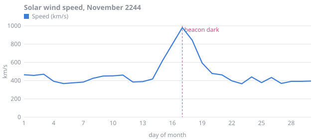
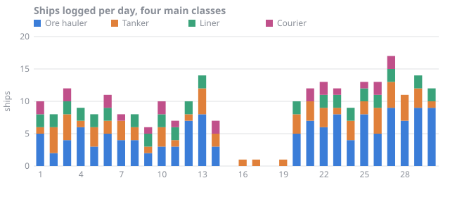
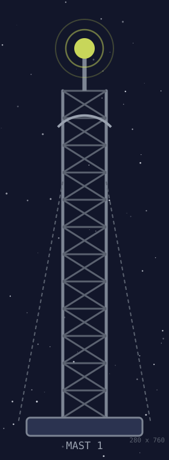
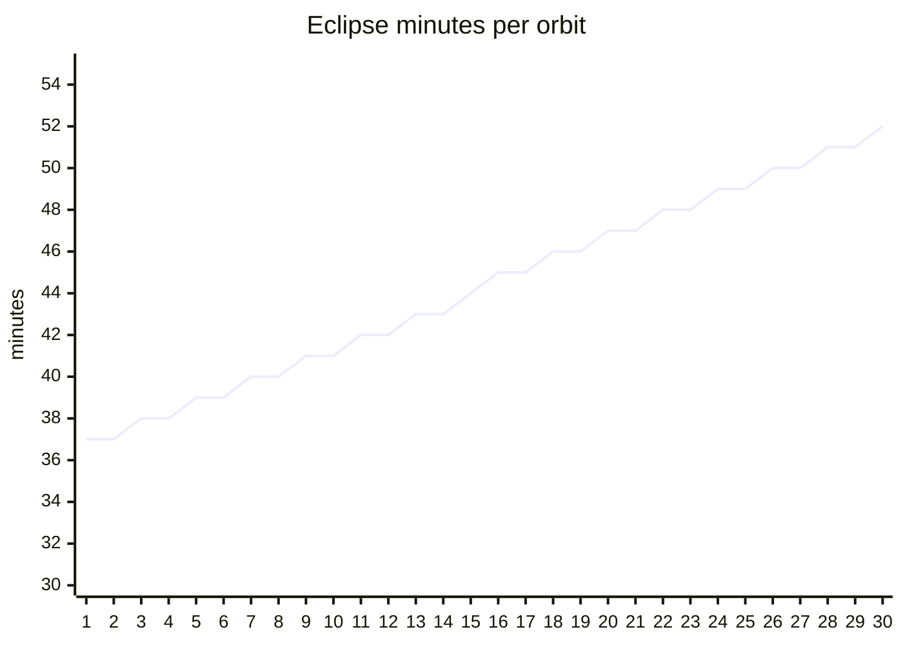

# Station log, November 2244

[Back to the station](../README.md) · [October](2244-10.md) · December (not yet written)

Solar wind is km/s at the forward sensor. Range is the distance in megametres at which a ship can hold lock on the beacon. Dose is crew dose in microsieverts. Eclipse is minutes per orbit in the planet's shadow. Blackout is hours with no radio.

| Date | Solar wind | Range | Dose | Eclipse | Blackout | Ships | Notes |
| :--- | ---: | ---: | ---: | ---: | ---: | ---: | :--- |
| 2244-11-01 | 464 | 30 | 11 | 37 |  | 10 | New month. Fresnel caught a moth in hydroponics. We do not know how a moth got here. |
| 2244-11-02 | 457 | 29.4 | 12 | 37 |  | 9 |  |
| 2244-11-03 | 470 | 34.3 | 14 | 38 |  | 12 | Supply tender docked: xenon, scrubber cartridges, a crate of real oranges. |
| 2244-11-04 | 393 | 29.3 | 12 | 38 |  | 9 |  |
| 2244-11-05 | 368 | 36.4 | 16 | 39 |  | 8 |  |
| 2244-11-06 | 376 | 32.3 | 15 | 39 |  | 11 | Survey drones mapped four new rocks in the trailing cluster. |
| 2244-11-07 | 384 | 34.2 | 12 | 40 |  | 8 |  |
| 2244-11-08 | 426 | 29.8 | 11 | 40 |  | 8 |  |
| 2244-11-09 | 450 | 34.2 | 15 | 41 |  | 7 | Antenna feed recalibrated. Bray says gain is up 0.2 dB. It is not. |
| 2244-11-10 | 452 | 32 | 16 | 41 |  | 10 |  |
| 2244-11-11 | 461 | 37 | 13 | 42 |  | 8 |  |
| 2244-11-12 | 385 | 37.2 | 13 | 42 |  | 10 | Inspector Mbeki docked. Signed the log, admired the waveguide brazing. |
| 2244-11-13 | 389 | 33.1 | 14 | 43 |  | 14 |  |
| 2244-11-14 | 418 | 36.8 | 16 | 43 |  | 7 | Flare alert from the forecast office. Storm shelter stocked. |
| 2244-11-15 | 619 | 22.5 | 62 | 44 |  | 0 |  |
| 2244-11-16 | 800 | 8.3 | 112 | 45 | 4 | 1 | CME arrival forecast for 01:30 tomorrow. Tender cancelled. |
| 2244-11-17 | 981 | 0.4 | 165 | 45 | 6 | 1 | Beacon dark 02:14 to 02:41. See incident report. |
| 2244-11-18 | 842 | 7.7 | 113 | 46 | 3 | 0 | Solar wind easing. Sensor mast pane crazed by a pebble, sealed. |
| 2244-11-19 | 593 | 18.2 | 61 | 46 |  | 1 |  |
| 2244-11-20 | 478 | 29.1 | 13 | 47 |  | 10 |  |
| 2244-11-21 | 463 | 34 | 12 | 47 |  | 12 | Replacement mast pane fitted on a spacewalk. Fresnel watched from the cupola. |
| 2244-11-22 | 398 | 34.4 | 15 | 48 |  | 13 |  |
| 2244-11-23 | 366 | 29.6 | 13 | 48 |  | 13 |  |
| 2244-11-24 | 440 | 36.7 | 14 | 49 |  | 9 | Survey ship *Tern* parked in our shadow overnight to cool its detectors. |
| 2244-11-25 | 378 | 35.9 | 12 | 49 |  | 13 |  |
| 2244-11-26 | 434 | 29.8 | 14 | 50 |  | 13 |  |
| 2244-11-27 | 369 | 37.6 | 13 | 50 |  | 17 | Eclipse season deepens. Heaters on the battery racks for the first time. |
| 2244-11-28 | 392 | 32 | 15 | 51 |  | 11 |  |
| 2244-11-29 | 392 | 36.7 | 14 | 51 |  | 14 |  |
| 2244-11-30 | 395 | 29.1 | 15 | 52 |  | 12 | Month closed. Noodle night. |
| **Total** | | | **853** | | **13** | **271** | |

## Charts





The pane that cracked on the 17th is the third bay up on ![Mast 1][mast], which is also where the dish mount is, so both jobs wait on the same EVA.

<div align="center">
  <figure>
    
    <figcaption>Mast 1 from the cupola, the morning after.</figcaption>
  </figure>
</div>

Quill's photograph of the same mast, taken before the storm, is ![mast] for comparison; nothing in it looks different.

Eclipses lengthen as the station's orbit tilts toward the planet's shadow:



Blackout hours, as the relief crew prefers to read them:

```text
2244-11-16  ████        4 h
2244-11-17  ██████      6 h
2244-11-18  ███         3 h
```

## Remarks

- [x] Log countersigned by the inspector on 2244-11-12 :heavy_check_mark:
- [ ] Return the inspector's coffee cup :coffee: (Bray says it is ours now)
- [x] Incident report filed for 2244-11-17
- [ ] Order a spare sensor-mast pane before the next storm
- [x] ~~Ask the tender for more oranges~~ The tender brought them unasked, which has never happened before

[mast]: ../tour/mast.svg "Mast 1, sensor bay three"

<!-- Bray: Quill, if you ever read this file raw, the reserved bits are not radiation. They say the same thing every ten seconds. -->
