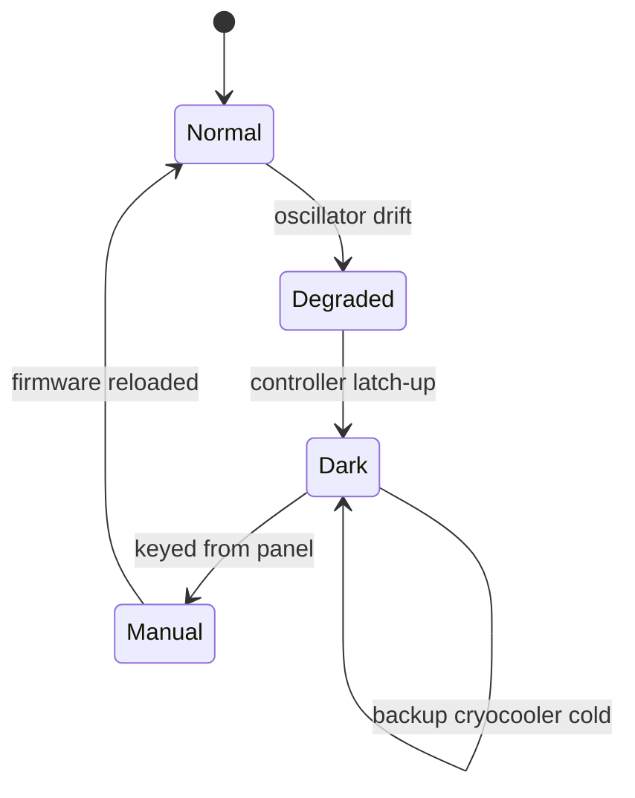

# Incident: the beacon went dark

| | |
| :--- | :--- |
| **When** | 2244-11-17, 02:14 to 02:41 station time |
| **Dark for** | 27 minutes |
| **Solar wind** | 981 km/s at the peak |
| **Ships at risk** | One: the tanker *Ormond Drift*, which held station 6 Mm off the belt edge |
| **Written by** | Ada Quill |

## What happened

At 02:14 the beacon fell silent for the first time in eleven years. A coronal mass ejection had been hitting the station since midnight, and a single-event upset latched the amplifier controller. The backup transmitter should have taken over and did not, because its cryocooler had been left in standby after the October service.

We keyed the beacon from the manual panel at 02:41 and kept pulse timing by hand for fifty minutes. Nobody was hurt. The *Ormond Drift* called at 02:20 to ask whether we were still there, which is a question no beacon crew wants to hear.

## Timeline

| Time | Event | Beacon |
| :---: | :--- | :--- |
| 01:52 | Solar wind 910 km/s. Proton flux climbing. Beacon normal. | Normal |
| 02:06 | Phase lock wanders. Bray reports the master oscillator drifting 40 Hz. | Degraded |
| 02:14 | Beacon silent. Single-event upset latched the amplifier controller. Backup transmitter will not key: its cryocooler was in standby. | Dark |
| 02:17 | Quill to the transmitter bay. Bray to the storm shelter console. | Dark |
| 02:19 | Receiver logs the unexplained narrowband signal for 70 seconds, from the trailing cluster. The beacon was silent, so it was not an echo. | Dark |
| 02:23 | Omnidirectional distress tone started by hand so ships have something. | Dark |
| 02:31 | Controller power-cycled. First restart fails: the watchdog trips again. | Dark |
| 02:41 | Beacon keyed from the manual panel. Pulse timing kept by hand from the reference clock until 03:30. | Manual |
| 03:30 | Controller firmware reloaded from the shielded store. Automatic timing restored. | Normal |
| 06:10 | Sensor mast pane found crazed. Sealed from inside. | Normal |

```mermaid
timeline
    title Night of 16 to 17 November
    01:52 : Beacon normal
    02:06 : Phase lock wanders
    02:14 : Beacon silent
          : Backup will not key
    02:19 : Narrowband signal logged
    02:23 : Distress tone by hand
    02:41 : Beacon keyed manually
          : Hand-timed pulses
    03:30 : Automatic timing restored
```



## Last frames before the silence

The transmitter monitor keeps the last ten frames it sent. The fields are those of the [pulse format](../beacon.md#pulse-format): sync word, station ID, epoch, sub-second, hazard flags, CRC.

```text
02:13:50  1ACFFC1D 5704 0000546959DE 00068DB8 0E 2A79
02:13:51  1ACFFC1D 5704 0000546959DF 00068DCB 76 CD4C
02:13:52  1ACFFC1D 5704 0000546959E0 00068DDE CE FD96
02:13:53  1ACFFC1D 5704 0000546959E1 00068DF1 7E 0935
02:13:54  1ACFFC1D 5704 0000546959E2 00068E04 76 F3B9
02:13:55  1ACFFC1D 5704 0000546959E3 00068E17 2E 3BC4
02:13:56  1ACFFC1D 5704 0000546959E4 00068E2A 46 6DE2
02:13:57  1ACFFC1D 5704 0000546959E5 00068E3D 7E 05FD
02:13:58  1ACFFC1D 5704 0000546959E6 00068E50 6E A45A
02:13:59  1ACFFC1D 5704 0000546959E7 00068E63 2E F9F8
```

During a storm with a blackout forecast the hazard byte should read `06`. Bray has pointed out, more than once, that it does not. Quill puts it down to radiation damage in the capture buffer. Every CRC checks.

## Why the backup failed

1. The backup transmitter's cryocooler takes 40 minutes to reach operating temperature.
2. It was left in standby after the October service.
   1. The service checklist says to return it to warm standby.
   2. The checklist was signed. The step was not done. See [maintenance](../maintenance.md#work-plan).
3. Nobody checked the backup after the service, because the weekly test only checks that it powers on.

## Actions

| # | Action | Owner | Due | Done |
| ---: | :--- | :--- | :--- | :---: |
| 1 | Hold the backup cryocooler in warm standby at all times | Bray | 2244-11-18 | ✅ |
| 2 | Weekly test must key the backup at full power for 60 s | Quill | 2244-11-20 | ✅ |
| 3 | Radiation-harden the amplifier controller | Yard engineers | 2244-12-05 | ⬜ |
| 4 | Fit a watchdog that fails over instead of retrying | Yard engineers | 2245-02 | ⬜ |
| 5 | Replace the crazed sensor-mast pane | Bray | 2244-11-21 | ✅ |

> [!NOTE]
> The *Ormond Drift* sent a bottle of something amber with the next tender. It has been logged as a gift. Stores never saw it.
