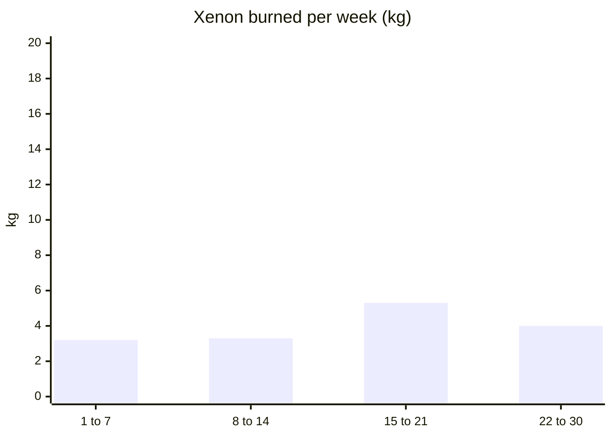
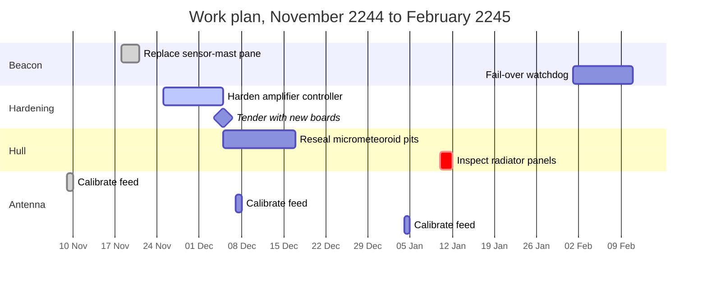
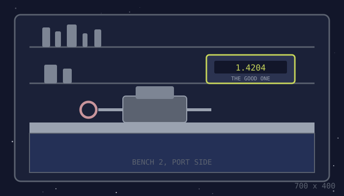

# Maintenance

## Stores

| Item | Unit | Capacity | On hand | Reorder at | Notes |
| :--- | :--- | ---: | ---: | ---: | :--- |
| Xenon (thruster) | kg | 180 | **41** | 60 | Tender, 2244-12-05 |
| Amplifier controller boards | each | 6 | **1** | 2 | One latched up in the storm |
| CO₂ scrubber cartridges | each | 40 | 16 | 10 |  |
| Waveguide gaskets | each | 24 | **4** | 6 | Now kept in the shielded store |
| Sensor-mast panes | each | 2 | 1 | 1 | One used 2244-11-21. **Order another.** |
| Oranges, real | each | 60 | 38 | 12 | Morale item |
| Coffee | kg | 20 | **6** | 8 | Below reorder level |
| Cat food | tins | 90 | **22** | 30 | Below reorder level |

Xenon used for station-keeping, per week:

Bin 8 has been empty since the 17th. The yard acknowledged the request and has not scheduled it.

## Work plan

<figure><figcaption>Bench 2. The good multimeter is the one that reads to four places, and it does not leave this bench.</figcaption></figure>

MOTH-3 does the outside half of this schedule. Six legs, one opinion, and a service interval nobody has ever met.

## Calibration schedule

The feed is calibrated every four weeks, and Bray calibrates it in between whenever he thinks nobody is looking.

| Task | Every | Last done | Next due | By |
| :--- | :--- | :--- | :--- | :--- |
| Calibrate antenna feed | 4 weeks | 2244-11-09 | 2244-12-07 | Bray |
| Discipline the reference clock | 1 week | 2244-11-20 | 2244-11-27 | Quill |
| Key the backup at full power | 1 week | 2244-11-20 | 2244-11-27 | Quill |
| Swap a scrubber cartridge | 3 days | 2244-11-29 | 2244-12-02 | MOTH-3 |
| Brush Fresnel off the console | 1 hour | always | always | whoever is awake |
