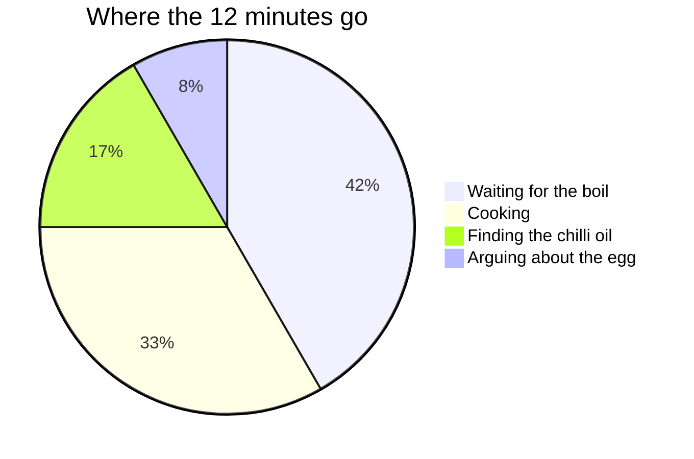

# Station noodles

Served on the last night of every month, and on any night the tender is cancelled. They are better the next day, but there never are any left.

| Crew | 1 | 2 | 3 | 4 | 6 |
| :--- | ---: | ---: | ---: | ---: | ---: |
| Dried noodles | 90 g | 180 g | 270 g | 360 g | 540 g |
| Hydroponic greens | 1 handful | 2 handful | 3 handful | 4 handful | 6 handful |
| Mushroom broth concentrate | 1 cube | 2 cube | 3 cube | 4 cube | 6 cube |
| Soy sauce | 1 tbsp | 2 tbsp | 3 tbsp | 4 tbsp | 6 tbsp |
| Water | 400 ml | 800 ml | 1200 ml | 1600 ml | 2400 ml |
| Chilli oil | 0.5 tsp | 1 tsp | 1.5 tsp | 2 tsp | 3 tsp |
| Spring onion | 1 stalk | 2 stalk | 3 stalk | 4 stalk | 6 stalk |
| Real egg, if the tender brought any | 1 | 2 | 3 | 4 | 6 |

## Method

1. Bring the water to the boil. At station pressure that is 94 °C, so add a minute to everything.
2. Dissolve the broth cube and the soy sauce.
3. Add the noodles, 4 minutes. Add the greens for the last minute.
4. Crack in the egg, if there is one, and stir once.
5. Chilli oil, spring onion, bowls with lids. Always lids. Remember what happened in 2239.

Time spent, by step:

> Fresnel gets the broth left in the bowls. This is not negotiable.
