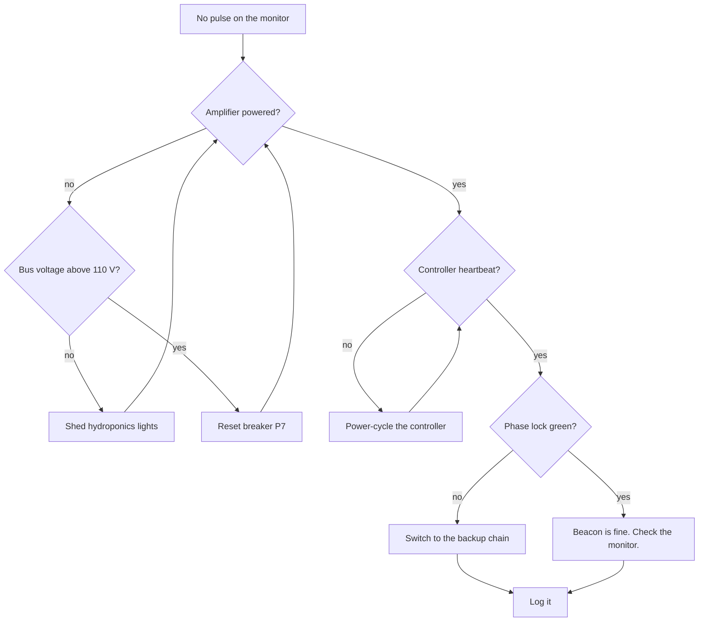

# Beacon runbook: the beacon will not transmit

The beacon must pulse once a second, every second. If the forward monitor shows a gap longer than three seconds, work down this page.



## Steps

1. Check the amplifier is powered. The bay fans are audible from the hatch.
2. If it is silent, check the bus panel:
   - Bus above 110 V: reset breaker **P7**.
   - Bus below 110 V: shed the hydroponics lights, then check again.
3. Watch for the controller heartbeat LED. If it is dark for more than 5 seconds, power-cycle the controller.
4. If phase lock will not go green, switch to the backup chain:
   ```sh
   beaconctl chain --select backup --confirm
   beaconctl status --watch
   ```
5. If the backup will not key either, key the beacon by hand from the manual panel and keep time from the reference clock. Wake the other crew member.
6. Write what you did in the [log](../log/2244-11.md).

## Fault codes

| Code | Meaning | What to do |
| :---: | :--- | :--- |
| `B1` | Bus undervoltage | Step 2 |
| `B2` | Amplifier over temperature | Let it cool 20 minutes, then step 1 |
| `B3` | Controller latch-up | Step 3. Suspect radiation if there is a storm. |
| `B4` | Backup cryocooler cold | Wait 40 minutes, or key by hand (step 5) |
| `B5` | Cat in the waveguide access port | Remove cat. Step 1. |

<!-- W.A., 2231: if anything ever comes out of the waveguide access port, read archive/2231/handover.md before you report it. -->

> [!CAUTION]
> Never key the beacon by hand for more than an hour alone. Timing drifts when you are tired, and ships steer by it.
