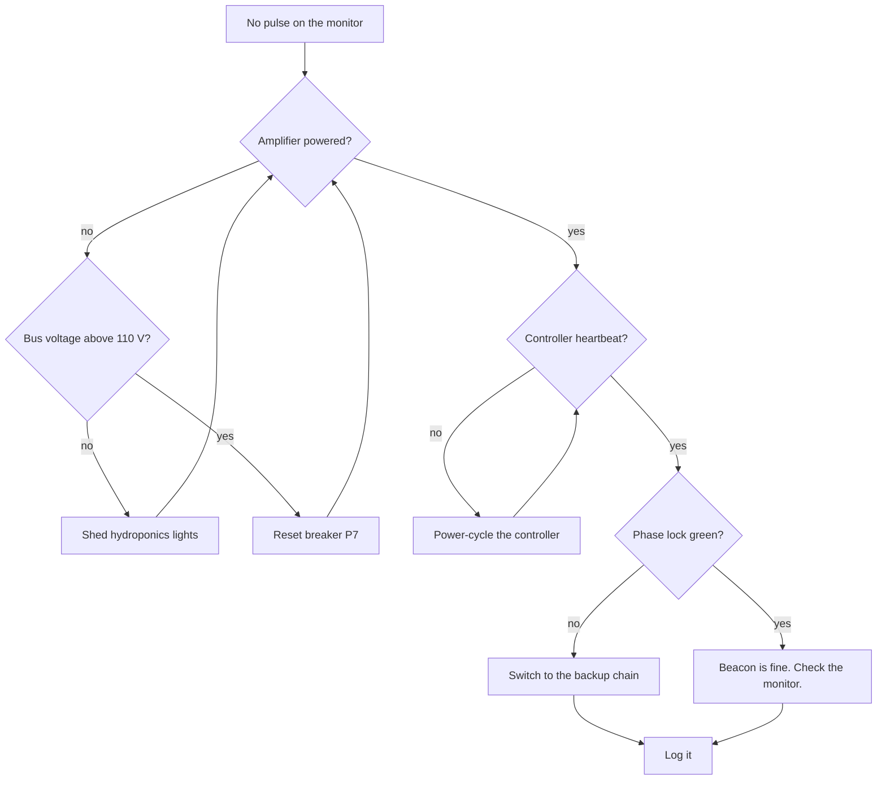

# Beacon runbook: the beacon will not transmit

The beacon must pulse once a second, every second. If the forward monitor shows a gap longer than three seconds, work down this page.




Step 6 is the only one that takes you outside. Nobody does it alone, and nobody does it during a blackout forecast.

## Steps

1. Check the amplifier is powered. The bay fans are audible from the hatch.
2. If it is silent, check the bus panel:
   - Bus above 110 V: reset breaker **P7**.
   - Bus below 110 V: shed the hydroponics lights, then check again.
3. Watch for the controller heartbeat LED. ~Wait a full minute before power-cycling.~ Superseded 2244-11-18: if it is dark for more than 5 seconds, power-cycle the controller.
4. If phase lock will not go green, switch to the backup chain:
   ```sh
   beaconctl chain --select backup --confirm
   beaconctl status --watch
   ```
5. If the backup will not key either, key the beacon by hand from the manual panel and keep time from the reference clock. Wake the other crew member.
6. Write what you did in the [log](../log/2244-11.md).

## Keying by hand

Step 5 in full. Do not start this without the other crew member awake and in the cupola.

### Before you key

#### At the panel

Set the mode switch to MANUAL and confirm the interlock lamp is out. If it is lit the chain is still live and keying by hand will back-feed the amplifier.

The interlock will not clear from the console. Hold <kbd>Alt</kbd> + <kbd>Break</kbd> on the panel keypad for three seconds, which is the only thing on this station that still needs a key combination.

#### At the reference clock

Take the time from the caesium reference, not from the console. The console clock is disciplined by the beacon, so during an outage it drifts with whatever you are about to send.

### Keying

Ten seconds on, fifty off, on the minute. Count with the reference, not in your head.

#### If you lose count

Stop. A gap is recoverable and a wrong pulse is not, because a ship that locks onto a wrong pulse steers on it for the next four hours.

##### Recovering the count

Wait for the next whole minute on the reference and start again from there. Note the gap in the log with the minute it started.

###### What the yard needs from you afterwards

The start minute, the gap length in whole seconds, and the reference serial. Nothing else. They will ask for the console log and it is the one thing that is worthless here.

## If none of that works

Call the yard, which is Harrow Yard Refit &amp; Overhaul on the paperwork and never on the radio. The duty desk is <duty@oriel-yard.example> and answers inside four hours on a working day, longer during a storm. The escalation form is at https://oriel-yard.example/forms/beacon-outage and wants the fault code from the table below. It will accept the code in the address instead, as `?code=E12&station=WREN4`, which saves a page. The pulse format it asks you to confirm is published at <https://oriel-yard.example/std/BCN-4.pdf>.

### The line to put in your shell profile

Fenced with tildes because the line itself is full of backticks, and a backtick fence would end halfway through it.

~~~sh
alias bstat='echo "$(beaconctl status --once)" && echo "ref `refclk --serial`"'
~~~

## Fault codes

| Code | Meaning | What to do |
| :---: | :--- | :--- |
| `B1` | Bus undervoltage | Step 2 |
| `B2` | Amplifier over temperature | Let it cool 20 minutes, then step 1 |
| `B3` | Controller latch-up | Step 3. Suspect radiation if there is a storm. |
| `B4` | Backup cryocooler cold | Wait 40 minutes, or key by hand (step 5) |
| `B5` | Cat in the waveguide access port | Remove cat. Step 1. |

<!-- W.A., 2231: if anything ever comes out of the waveguide access port, read archive/2231/handover.md before you report it. -->

> [!CAUTION]
> Never key the beacon by hand for more than an hour alone. Timing drifts when you are tired, and ships steer by it.
