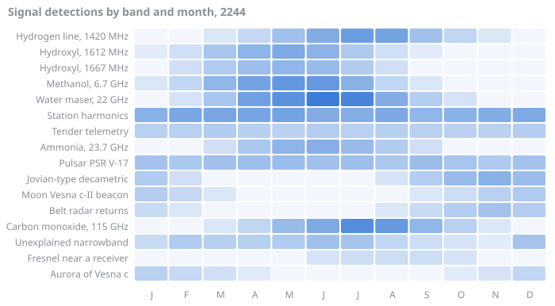
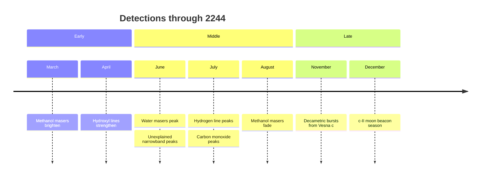

# Signals

Between pulses the beacon's dish listens. The receiver logs every detection above five sigma, sorted into bands. Most of it is molecules in the belt's gas and the planet's aurora. Some of it is the station hearing itself. One band we cannot explain.



## Detections

> [!TIP]
> Bray's note, taped to the console: *read each month's count on the Unexplained narrowband row as a letter, A = 1. January is 6, so F. February is 15, so O. Twelve months, twelve letters. I had F, O, L, L when Quill walked in.* The counts are also listed on one line [below](#the-unexplained-narrowband-signal), for anyone the table is too wide for.

| Band | Jan | Feb | Mar | Apr | May | Jun | Jul | Aug | Sep | Oct | Nov | Dec | Peak |
| :--- | ---: | ---: | ---: | ---: | ---: | ---: | ---: | ---: | ---: | ---: | ---: | ---: | :--- |
| Hydrogen line, 1420 MHz | 0 | 0 | 2 | 7 | 23 | 42 | 62 | 53 | 22 | 9 | 2 | 0 | Jul |
| Hydroxyl, 1612 MHz | 1 | 4 | 18 | 34 | 46 | 35 | 16 | 4 | 1 | 0 | 0 | 0 | May |
| Hydroxyl, 1667 MHz | 0 | 4 | 15 | 24 | 33 | 28 | 14 | 4 | 0 | 0 | 0 | 0 | May |
| Methanol, 6.7 GHz | 2 | 9 | 33 | 53 | 70 | 68 | 36 | 9 | 2 | 0 | 0 | 0 | May |
| Water maser, 22 GHz | 0 | 3 | 19 | 58 | 78 | 115 | 99 | 42 | 13 | 3 | 0 | 0 | Jun |
| Station harmonics | 38 | 49 | 50 | 51 | 53 | 43 | 41 | 47 | 33 | 36 | 42 | 46 | May |
| Tender telemetry | 11 | 11 | 14 | 12 | 10 | 13 | 11 | 12 | 11 | 10 | 10 | 13 | Mar |
| Ammonia, 23.7 GHz | 0 | 0 | 4 | 17 | 34 | 39 | 27 | 14 | 4 | 0 | 0 | 0 | Jun |
| Pulsar PSR V-17 | 21 | 17 | 22 | 24 | 26 | 23 | 24 | 17 | 25 | 19 | 16 | 21 | May |
| Jovian-type decametric | 15 | 4 | 0 | 0 | 0 | 0 | 0 | 3 | 13 | 27 | 36 | 26 | Nov |
| Moon Vesna c-II beacon | 13 | 7 | 2 | 0 | 0 | 0 | 0 | 0 | 2 | 5 | 11 | 15 | Dec |
| Belt radar returns | 6 | 2 | 0 | 0 | 0 | 0 | 0 | 2 | 6 | 13 | 21 | 13 | Nov |
| Carbon monoxide, 115 GHz | 0 | 0 | 2 | 9 | 28 | 45 | 83 | 66 | 33 | 11 | 2 | 0 | Jul |
| Unexplained narrowband | 6 | 15 | 12 | 12 | 15 | 23 | 20 | 8 | 5 | 3 | 1 | 20 | Jun |
| [Fresnel near a receiver](crew/fresnel.md) | 0 | 0 | 0 | 0 | 0 | 3 | 5 | 5 | 5 | 3 | 0 | 0 | Jul |
| Aurora of Vesna c | 11 | 7 | 4 | 1 | 0 | 0 | 0 | 0 | 0 | 1 | 3 | 8 | Jan |

## The same, at a glance

```text
                            J F M A M J J A S O N D
Hydrogen line, 1420 MHz     · · ░ ░ ▒ ▓ █ █ ▒ ░ ░ ·
Hydroxyl, 1612 MHz          ░ ░ ▒ ▓ █ █ ▒ ░ ░ · · ·
Hydroxyl, 1667 MHz          · ░ ▒ ▓ █ █ ▒ ░ · · · ·
Methanol, 6.7 GHz           ░ ░ ▒ █ █ █ ▓ ░ ░ · · ·
Water maser, 22 GHz         · ░ ░ ▓ ▓ █ █ ▒ ░ ░ · ·
Station harmonics           ▓ █ █ █ █ █ █ █ ▓ ▓ █ █
Tender telemetry            █ █ █ █ ▓ █ █ █ █ ▓ ▓ █
Ammonia, 23.7 GHz           · · ░ ▒ █ █ ▓ ▒ ░ · · ·
Pulsar PSR V-17             █ ▓ █ █ █ █ █ ▓ █ ▓ ▓ █
Jovian-type decametric      ▒ ░ · · · · · ░ ▒ █ █ ▓
Moon Vesna c-II beacon      █ ▒ ░ · · · · · ░ ▒ ▓ █
Belt radar returns          ▒ ░ · · · · · ░ ▒ ▓ █ ▓
Carbon monoxide, 115 GHz    · · ░ ░ ▒ ▓ █ █ ▒ ░ ░ ·
Unexplained narrowband      ▒ ▓ ▓ ▓ ▓ █ █ ▒ ░ ░ ░ █
Fresnel near a receiver     · · · · · ▓ █ █ █ ▓ · ·
Aurora of Vesna c           █ ▓ ▒ ░ · · · · · ░ ▒ ▓
```

## The signal year



## The unexplained narrowband signal

| Property | Value |
| :--- | :--- |
| Frequency | 1,420.4058 MHz, 0.9 kHz above the hydrogen line |
| Bandwidth | under 1 Hz |
| Direction | Fixed on the sky, toward the trailing cluster |
| Repeats | Every 26.3 days, for about 70 seconds |
| Detections per month, January to December | 6 15 12 12 15 23 20 8 5 3 1 20 |
| Detections in 2244 | 140 |
| First logged | 2230-08-02, 02:14 station time, before either of the current crew arrived |
| Explanation | None. Bray thinks the monthly counts are letters. Quill has asked him to stop. |
| Bray's decode so far | F O L L ... |

Trends for the three bands we watch most closely:

| Band | 2242 | 2243 | 2244 | Trend |
| :--- | ---: | ---: | ---: | :---: |
| Hydrogen line | 61 | 52 | 62 | ▇▁█ |
| Water maser | 180 | 150 | 115 | █▅▁ |
| Unexplained narrowband | 18 | 22 | 23 | ▁▇█ |
