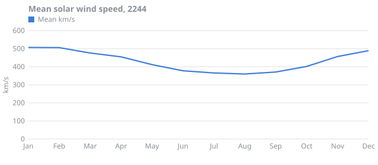
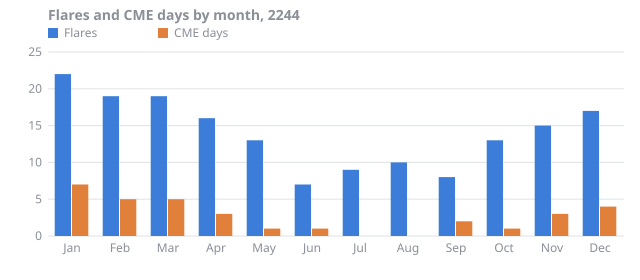
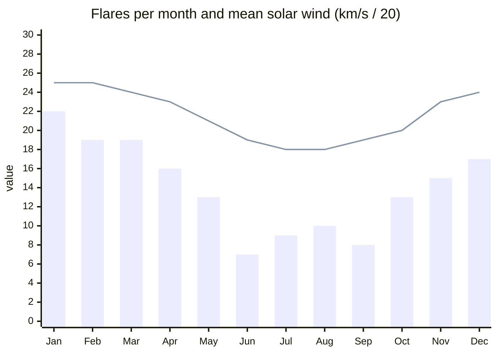
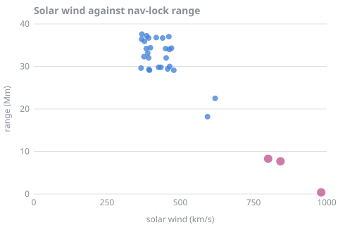
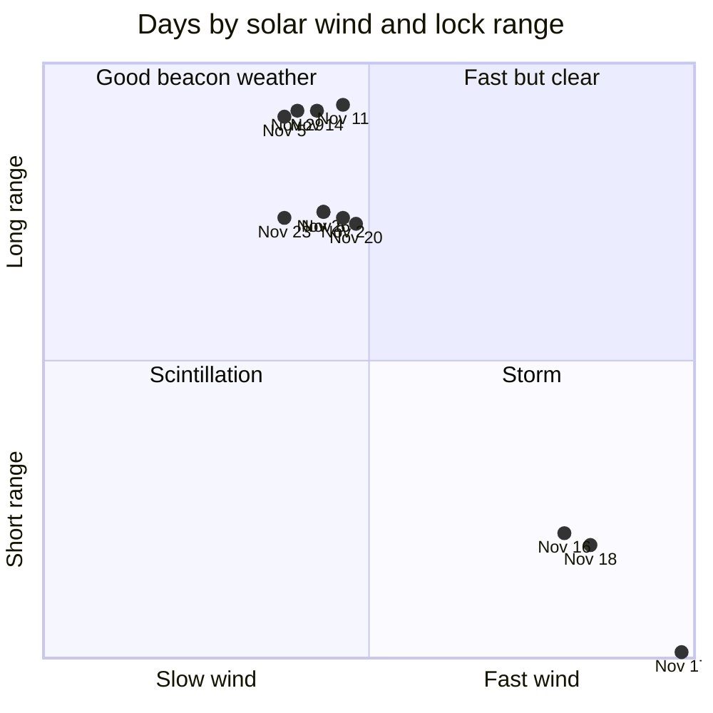

# Space weather

Wren-4 sits in the open, with nothing between it and the star but 2.1 AU of plasma. This page keeps the station's space-weather records for 2244 and the detail of the November storm.

## The year

| Month | Solar wind (km/s) | Flares | CME days | Blackout days |
| :--- | ---: | ---: | ---: | ---: |
| Jan | 507 | 22 | 7 | 7 |
| Feb | 506 | 19 | 5 | 7 |
| Mar | 476 | 19 | 5 | 7 |
| Apr | 455 | 16 | 3 | 6 |
| May | 412 | 13 | 1 | 6 |
| Jun | 378 | 7 | 1 | 4 |
| Jul | 366 | 9 | 0 | 3 |
| Aug | 360 | 10 | 0 | 2 |
| Sep | 371 | 8 | 2 | 4 |
| Oct | 402 | 13 | 1 | 6 |
| Nov | 457 | 15 | 3 | 6 |
| Dec | 489 | 17 | 4 | 9 |
| **Year** | **432** | **168** | **32** | **67** |

The same year drawn four ways, because the relief crew cannot agree on a tool.

**As an image**, which renders anywhere:





**As Mermaid:**



**As Vega-Lite:**

```vega-lite
{
  "$schema": "https://vega.github.io/schema/vega-lite/v5.json",
  "description": "CME days by month at Wren-4, 2244",
  "data": {
    "values": [
      {"month": "Jan", "cme_days": 7, "blackout_days": 7},
      {"month": "Feb", "cme_days": 5, "blackout_days": 7},
      {"month": "Mar", "cme_days": 5, "blackout_days": 7},
      {"month": "Apr", "cme_days": 3, "blackout_days": 6},
      {"month": "May", "cme_days": 1, "blackout_days": 6},
      {"month": "Jun", "cme_days": 1, "blackout_days": 4},
      {"month": "Jul", "cme_days": 0, "blackout_days": 3},
      {"month": "Aug", "cme_days": 0, "blackout_days": 2},
      {"month": "Sep", "cme_days": 2, "blackout_days": 4},
      {"month": "Oct", "cme_days": 1, "blackout_days": 6},
      {"month": "Nov", "cme_days": 3, "blackout_days": 6},
      {"month": "Dec", "cme_days": 4, "blackout_days": 9}
    ]
  },
  "mark": "bar",
  "encoding": {
    "x": {"field": "month", "type": "ordinal", "sort": null},
    "y": {"field": "cme_days", "type": "quantitative", "title": "CME days"}
  }
}
```

**As a note-app chart block:**

```chart
type: line
labels: [Jan, Feb, Mar, Apr, May, Jun, Jul, Aug, Sep, Oct, Nov, Dec]
series:
  - title: Blackout days
    data: [7, 7, 7, 6, 6, 4, 3, 2, 4, 6, 6, 9]
  - title: CME days
    data: [7, 5, 5, 3, 1, 1, 0, 0, 2, 1, 3, 4]
tension: 0.2
width: 80%
beginAtZero: true
```

## Does fast wind shorten the beacon's reach?

Yes. Each dot is one November day. The pink dots are the storm.





## The November storm, hour by hour

Readings from the forward sensor, 2244-11-16 00:00 to 2244-11-17 23:00. Speed in km/s, the magnetic field's north-south component Bz in nanotesla, proton flux in particles per cm² per second per steradian, and the station's own 0 to 9 storm index.

```csv
time,speed_km_s,bz_nT,proton_flux,storm_index
2244-11-16T00:00,405,-1.7,4,1
2244-11-16T01:00,411,-1.2,4,1
2244-11-16T02:00,386,-2,4,1
2244-11-16T03:00,390,-1.4,4,1
2244-11-16T04:00,386,-3.3,4,1
2244-11-16T05:00,419,-2.3,4,1
2244-11-16T06:00,394,-2.8,4,1
2244-11-16T07:00,388,-0.7,4,1
2244-11-16T08:00,418,-1.9,4,1
2244-11-16T09:00,420,-1,4,1
2244-11-16T10:00,393,-1,4,1
2244-11-16T11:00,400,-0.7,4,1
2244-11-16T12:00,405,-2.8,4,1
2244-11-16T13:00,417,-2.1,5,1
2244-11-16T14:00,443,-1.8,5,1
2244-11-16T15:00,467,-3.1,6,1
2244-11-16T16:00,494,-5,8,2
2244-11-16T17:00,542,-5.7,11,2
2244-11-16T18:00,567,-6.3,17,3
2244-11-16T19:00,619,-11.3,31,3
2244-11-16T20:00,702,-15.5,63,4
2244-11-16T21:00,767,-19.7,144,5
2244-11-16T22:00,826,-23.7,347,6
2244-11-16T23:00,857,-26.2,839,7
2244-11-17T00:00,893,-27.6,1874,8
2244-11-17T01:00,912,-30.8,3581,9
2244-11-17T02:00,944,-29.5,5453,9
2244-11-17T03:00,942,-26.1,6310,9
2244-11-17T04:00,894,-22.2,5453,8
2244-11-17T05:00,880,-19.2,3581,7
2244-11-17T06:00,821,-15.2,1874,6
2244-11-17T07:00,770,-9.3,839,5
2244-11-17T08:00,702,-6.4,347,4
2244-11-17T09:00,644,-5,144,3
2244-11-17T10:00,594,-4.9,63,3
2244-11-17T11:00,530,-2.8,31,2
2244-11-17T12:00,499,-3.7,17,2
2244-11-17T13:00,486,-3.2,11,1
2244-11-17T14:00,450,-1.9,8,1
2244-11-17T15:00,435,-1.6,6,1
2244-11-17T16:00,410,-3,5,1
2244-11-17T17:00,410,-2.3,5,1
2244-11-17T18:00,413,-2.4,4,1
2244-11-17T19:00,392,-1.1,4,1
2244-11-17T20:00,386,-2.6,4,1
2244-11-17T21:00,393,-2.8,4,1
2244-11-17T22:00,410,-1.1,4,1
2244-11-17T23:00,389,-1.5,4,1
```

Storm index, as the console strip chart drew it:

```text
9 ┤                    ▄█▄
7 ┤                  ▄█████▄
5 ┤               ▂▅█████████▅▂
3 ┤          ▂▃▅▇█████████████▇▅▃▂
1 ┤▁▁▁▁▁▁▂▃▅███████████████████████▅▃▂▁▁▁
  └────────────────────────────────────────
   16th 00:00         17th 02:14        17th 23:00
```
