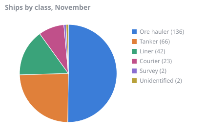
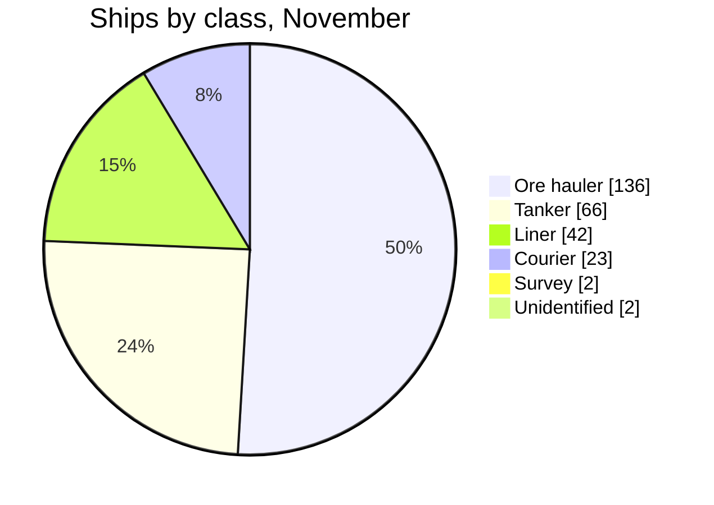
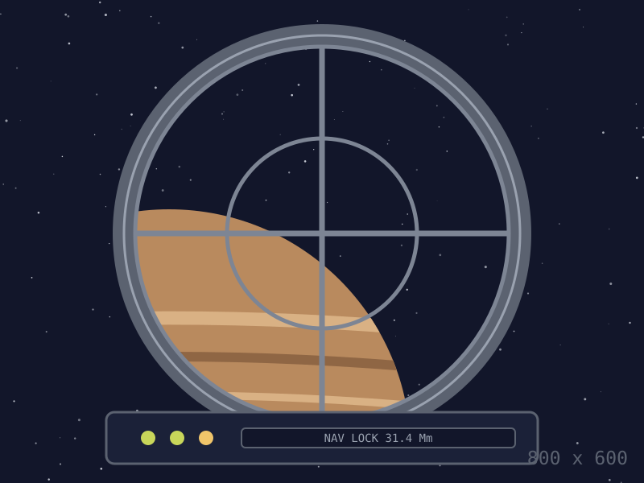

# Traffic

Every ship that locks the beacon is logged with its class and, when it answers a hail, where it is bound. November was quiet either side of the storm and busy after.



| Class | Ships | Share | Busiest day |
| :--- | ---: | ---: | :--- |
| Ore hauler | 136 | 50.2% | 2244-11-27 |
| Tanker | 66 | 24.4% | 2244-11-02 |
| Liner | 42 | 15.5% | 2244-11-01 |
| Courier | 23 | 8.5% | 2244-11-01 |
| Survey | 2 | 0.7% | 2244-11-02 |
| Unidentified | 2 | 0.7% | 2244-11-09 |




This is the view from the lane, which is what a ship sees for about forty minutes on its way past.

## Where they were bound

```mermaid
sankey-beta
Belt rocks,Oriel Ring,116
Oriel Ring,Vesna c-II,42
Harrow Yard,Farside Depot,33
Farside Depot,Harrow Yard,33
Belt rocks,Harrow Yard,20
Farside Depot,Trailing cluster,2
```

## Daily counts

| Day | Ore hauler | Tanker | Liner | Courier | Survey | Unidentified | Total |
| ---: | ---: | ---: | ---: | ---: | ---: | ---: | ---: |
| 1 | 5 | 1 | 2 | 2 | · | · | 10 |
| 2 | 2 | 4 | 2 | · | 1 | · | 9 |
| 3 | 4 | 4 | 2 | 2 | · | · | 12 |
| 4 | 6 | 1 | 2 | · | · | · | 9 |
| 5 | 3 | 3 | 2 | · | · | · | 8 |
| 6 | 5 | 2 | 2 | 2 | · | · | 11 |
| 7 | 4 | 3 | · | 1 | · | · | 8 |
| 8 | 4 | 2 | 2 | · | · | · | 8 |
| 9 | 2 | 1 | 2 | 1 | · | 1 | 7 |
| 10 | 3 | 3 | 2 | 2 | · | · | 10 |
| 11 | 3 | 1 | 2 | 1 | 1 | · | 8 |
| 12 | 7 | 1 | 2 | · | · | · | 10 |
| 13 | 8 | 4 | 2 | · | · | · | 14 |
| 14 | 3 | 2 | · | 2 | · | · | 7 |
| 15 | · | · | · | · | · | · | 0 |
| 16 | · | 1 | · | · | · | · | 1 |
| 17 | · | 1 | · | · | · | · | 1 |
| 18 | · | · | · | · | · | · | 0 |
| 19 | · | 1 | · | · | · | · | 1 |
| 20 | 5 | 3 | 2 | · | · | · | 10 |
| 21 | 7 | 3 | · | 2 | · | · | 12 |
| 22 | 6 | 3 | 2 | 2 | · | · | 13 |
| 23 | 8 | 1 | 2 | 1 | · | 1 | 13 |
| 24 | 4 | 3 | 2 | · | · | · | 9 |
| 25 | 8 | 2 | 2 | 1 | · | · | 13 |
| 26 | 5 | 4 | 2 | 2 | · | · | 13 |
| 27 | 9 | 4 | 2 | 2 | · | · | 17 |
| 28 | 7 | 4 | · | · | · | · | 11 |
| 29 | 9 | 3 | 2 | · | · | · | 14 |
| 30 | 9 | 1 | 2 | · | · | · | 12 |

<div align="center"><figure><figcaption>The cupola. Every ship below is a number that appeared on that readout first.</figcaption></figure></div>

## Regulars

| Ship | Class | From | To | Remarks |
| :--- | :--- | :--- | :--- | :--- |
| *Morrow Line 4* | Liner | Oriel Ring | Vesna c-II | Twice daily except on rest days |
| *Ormond Drift* | Tanker | Harrow Yard | Farside Depot | Called us during the storm |
| *Pick of the Belt* | Ore hauler | Rock 2231-QK | Oriel Ring | Leaves at shift change, back by next |
| *Tern* | Survey | Farside Depot | Trailing cluster | Counts rocks. Brought biscuits. |
| *鹮* | Liner | Wan-Ho Ring | Vesna c-II | Named for a bird nobody aboard has seen |
| *한빛* | Tender | Sejong Station | Oriel Ring | Brings the oranges ⭐ |
| *نسيم* | Survey | Qasr Depot | Trailing cluster | Works the cluster edge and reports nothing |
| *נחשון* | Ore hauler | Beit Marr | Oriel Ring | First through the lane after a storm, always |
| *Zéphyr* | Liner | Harrow Yard | Farside Depot | Odd days only, and never late |
| *Renée* | Survey | Harrow Yard | Rock 2231-QK | Quill's first posting was aboard her |
| *Unregistered, no transponder* | Unidentified | ? | ? | Twice this month, no lights, no reply |

Names are kept as the registering port writes them, so the first column runs in five scripts and two directions. The yard's manifest software cannot line them up either.
